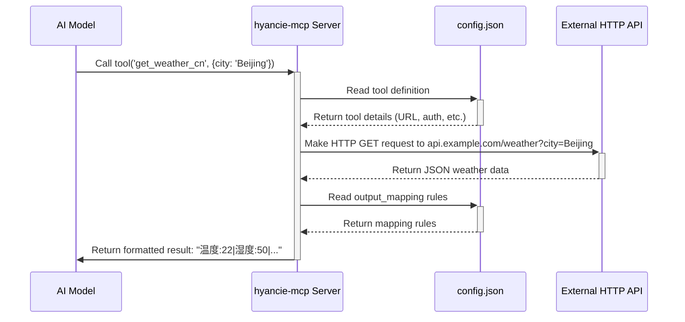
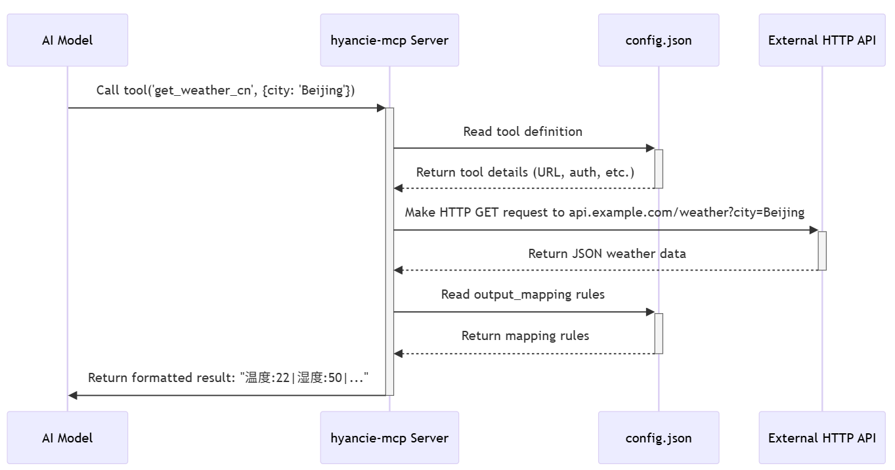

# Dynamic Configurable MCP Server

This project provides a dynamic, configurable MCP (Model-Context-Protocol) server written in Go. Its primary purpose is to wrap existing HTTP APIs and expose them as MCP tools without requiring any changes to the Go source code. New tools can be added and configured by simply editing the `config.json` file.

## Features

*   **Declarative Tool Creation**: Define tools entirely within a `config.json` file.
*   **No Go Programming Needed**: Add new tools by simply editing the configuration.
*   **HTTP Method Support**: Works with `GET`, `POST`, `PUT`, and other standard HTTP methods.
*   **Flexible Authentication**: Built-in support for API Key (`header`) and `Bearer Token` authentication.
*   **Powerful Response Mapping**: A flexible system to parse complex JSON responses (including nested objects and arrays) into clean, human-readable output for the model.

## How It Works

The server acts as a bridge between an AI model and any external HTTP API. When the model calls a tool, the server looks up the tool's definition in `config.json`, constructs the appropriate HTTP request, sends it to the target API, and then parses the response according to the mapping rules before returning a formatted result to the model.





## Getting Started

### Prerequisites

*   Go 1.18 or higher.

### Build

To build the executable, run the following command from the project root directory:

```bash
go build -o hyancie-mcp.exe ./cmd/hyancie
```

### Execution

The server can run in two transport modes: `stdio` (for local communication with a parent process) or `sse` (to expose an HTTP server with Server-Sent Events).

**Stdio Mode (Default):**

```bash
./hyancie-mcp.exe
```

**SSE Mode:**

You can specify the address for the SSE server.

```bash
./hyancie-mcp.exe -t sse --sse-address localhost:8001
```

| Flag          | Short | Description                               | Default Value |
|---------------|-------|-------------------------------------------|---------------|
| `--transport` | `-t`  | Transport type (`stdio` or `sse`)         | `stdio`       |
| `--sse-address` |       | The host and port for the SSE server.     | `localhost:8001` (from `config.json`) |


## Configuration (`config.json` Deep Dive)

This file is the heart of the server. It defines the server's identity and the tools it provides.

**Important:** The `config.json` file must be located in the same directory as the compiled executable (e.g., `hyancie-mcp.exe`). The server will look for it there at startup.

### Root Fields

*   `server_name` (string): The name of your MCP server.
*   `server_version` (string): The version of your server.
*   `sse_address` (string): The default address for the SSE server.
*   `mcp_tools` (array): An array of tool definition objects.

### Tool Object (`mcp_tools[]`)

Each object in the `mcp_tools` array defines a single tool.

*   `tool_name` (string, required): The unique identifier for the tool (e.g., `get_weather_cn`).
*   `description` (string, required): A clear description of what the tool does. This is what the AI model uses to decide when to use the tool.
*   `input_schema` (object, required): Defines the tool's arguments using JSON Schema.
    *   `type`: Should be "object".
    *   `properties`: An object where each key is an argument name and the value is a schema defining its type and description.
    *   `required`: An array of strings listing the mandatory arguments.
*   `request` (object, required): Configures the outgoing HTTP request.
    *   `method` (string): The HTTP method (e.g., "GET", "POST").
    *   `url` (string): The API endpoint. For `GET` requests, use `{placeholder}` syntax to insert arguments into the URL. For `POST`/`PUT`, the arguments from `input_schema` are sent as the JSON request body.
*   `authentication` (object, optional): Defines the authentication method.
    *   `type` (string): Can be `"bearer"` or `"header"`.
    *   For `bearer`: Provide a `token` (string).
    *   For `header`: Provide a `name` (string) for the header key and a `value` (string) for the header value.
*   `output_mapping` (array, required): A powerful system for parsing the JSON response from the API into a flat, text-based format for the model.
    *   `json_key` (string): The key to extract from the JSON response. Supports dot notation for nested objects (`main.temp`) and array indexing (`weather[0].description`).
    *   `description` (string): A human-readable label for the extracted value (e.g., "Temperature").
    *   `type` (string): Can be `"primitive"` or `"array"`.
        *   `primitive`: For extracting simple values like strings, numbers, or booleans.
        *   `array`: For processing a list of objects.
    *   `limit` (integer, optional): Used with `type: "array"` to restrict the number of items processed from the array.
    *   `items` (array, optional): Used with `type: "array"`. This is a nested `output_mapping` that defines how to process each object within the array.

## Usage Examples

### Example 1: Simple GET Request (`get_weather_cn`)

This tool fetches weather data. The `city` argument is inserted into the URL. The output mapping extracts simple, nested values from the JSON response.

**Config:**
```json
{
  "tool_name": "get_weather_cn",
  "description": "根据城市名称获取实时天气信息。",
  "request": {
    "method": "GET",
    "url": "https://api.example.com/weather?city={city}&unit=metric"
  },
  "input_schema": { ... },
  "output_mapping": [
    { "json_key": "main.temp", "description": "温度", "type": "primitive" },
    { "json_key": "main.humidity", "description": "湿度", "type": "primitive" },
    { "json_key": "weather[0].description", "description": "天气状况", "type": "primitive" }
  ]
}
```
**Result:** `温度:22|湿度:50|天气状况:clear sky`

### Example 2: Complex Array Processing (`food-info-search`)

This tool performs a search and processes a list of results. The `output_mapping` for the `results` key is of type `array`. It iterates through the top 3 items, and for each item, it applies the nested `items` mapping to extract the `title`, `url`, and `content`.

**Config:**
```json
{
  "tool_name": "food-info-search",
  "description": "食品网页搜索工具。提取并格式化前3个搜索结果。",
  "request": { ... },
  "input_schema": { ... },
  "output_mapping": [
    {
      "json_key": "results",
      "type": "array",
      "description": "搜索结果",
      "limit": 3,
      "items": [
        { "json_key": "title", "description": "标题", "type": "primitive" },
        { "json_key": "url", "description": "链接", "type": "primitive" },
        { "json_key": "content", "description": "简介", "type": "primitive" }
      ]
    }
  ]
}
```
**Result:** `搜索结果:[项1:{标题:..., 链接:...} | 项2:{标题:..., 链接:...} | 项3:{标题:..., 链接:...}]`

## Client

A sample Python client is available in the [`client/`](./client/) directory. Please see the [`client/README.md`](./client/README.md) for instructions on how to use it.

## License

This project is licensed under the GPLv2.0 License.
